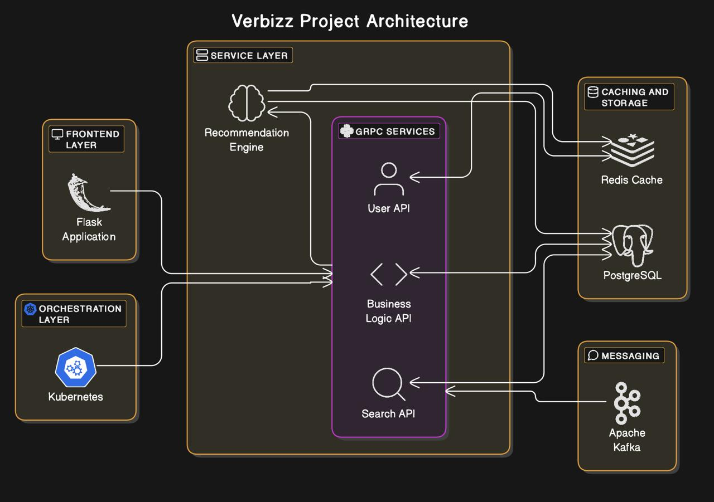

# Verbizz - Personalized Business Recommendation System

Verbizz is a scalable, cloud-based platform designed to deliver personalized business recommendations. This project leverages modern technologies like Flask, gRPC, Redis, Kafka, PostgreSQL, and Kubernetes to provide a seamless user experience for updating preferences and receiving recommendations in real-time.

## Table of Contents
- [Project Overview](#project-overview)
- [Features](#features)
- [Technologies Used](#technologies-used)
- [System Architecture](#system-architecture)
- [Installation](#installation)
  - [Backend Setup](#backend-setup)
  - [Frontend Setup](#frontend-setup)
- [Data Directory](#data-directory)
- [Usage](#usage)
- [Future Enhancements](#future-enhancements)

## Project Overview
Verbizz allows users to:
- Update their preferences (e.g., categories and city).
- View personalized business recommendations.
- Experience real-time updates powered by Kafka.

The project is built on a microservices architecture, ensuring scalability, reliability, and performance.

## Features
- **User-Friendly Interface**: Simple and interactive UI for updating preferences and receiving recommendations.
- **Real-Time Updates**: Kafka ensures asynchronous updates to recommendations.
- **Fast Performance**: Redis caching reduces latency and enhances user experience.
- **Scalability**: Kubernetes orchestrates microservices for seamless scaling.
- **Secure Storage**: PostgreSQL stores user profiles and business data securely.

## Technologies Used
### Backend
- Python with **gRPC** (business logic and API services)
- **PostgreSQL** (database)
- **Redis** (caching)
- **Apache Kafka** (messaging)
- **Kubernetes** and **Docker** (container orchestration)

### Frontend
- **Flask** (web application)
- HTML/CSS/JavaScript with Bootstrap for responsive design

### Other Tools
- Logging and monitoring tools for debugging
- Unit and integration testing frameworks

## System Architecture


## Installation

### Prerequisites
- Python 3.9+
- PostgreSQL
- Redis
- Kafka
- Docker and Kubernetes (for containerization and orchestration)

### Backend Setup
1. Clone the repository:
   ```bash
   git clone https://github.com/your-repo/verbizz.git
   
2. Navigate to the `backend` directory:
    ```bash
    cd backend
    ```
3. Create and activate a virtual environment:
    ```bash
    python3 -m venv .venv
    source .venv/bin/activate
    ```
4. Install dependencies:
    ```bash
    pip install -r requirements.txt
    ```
5. Start the backend server:
    ```bash
    python server.py
    ```

### Frontend Setup
1. Navigate to the `frontend` directory:
    ```bash
    cd frontend
    ```
2. Create and activate a virtual environment:
    ```bash
    python3 -m venv .venv
    source .venv/bin/activate
    ```
3. Install dependencies:
    ```bash
    pip install -r requirements.txt
    ```
4. Start the Flask app:
    ```bash
    flask run
    ```
## Data Directory

The `data` directory contains essential files for recommendations. Below is a description of its contents:

### Contents
1. **`final_cleaned_data.csv`**:
   - **Description**: Preprocessed and cleaned data used for generating recommendations.
   - **Purpose**: Provides structured data input for the recommendation engine.

2. **`full_data.pkl`**:
   - **Description**: Serialized file containing the full dataset.
   - **Purpose**: Used for training and testing the recommendation model.

3. **`tfidf_vectorizer.pkl`**:
   - **Description**: Pre-trained TF-IDF vectorizer model.
   - **Purpose**: Extracts features from textual data for content-based recommendations.
  
- These files are required for backend services and must not be modified unless re-training or re-processing is performed.
- Ensure these files are accessible to the backend during execution.

## Usage
1. Navigate to the frontend URL (default: `http://127.0.0.1:5000`).
2. Register or log in to your account.
3. Update your preferences (categories and city).
4. View personalized recommendations based on your preferences.

## Future Enhancements
- Integrate advanced machine learning models for more accurate recommendations.
- Enhance UI/UX for a richer user experience.
- Add support for multilingual recommendations.
- Implement detailed analytics and reporting features.
  
---

Happy coding! 🎉
